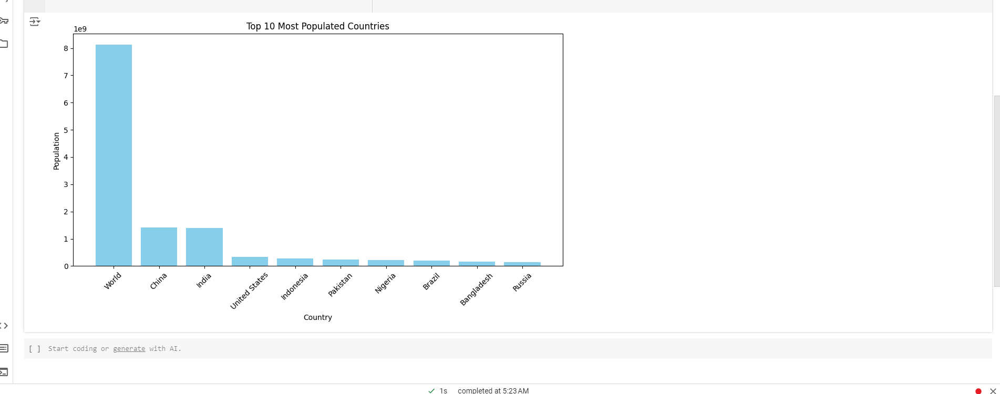

# Wikipedia Scraping Project

## Overview

In this project, we are going to build a **Wikipedia Scraping Tool**. This tool will allow you to automatically collect data from Wikipedia pages, such as infoboxes, tables, and plain text. You will learn how to clean, store, and visualize this data using Python libraries like **BeautifulSoup**, **Pandas**, and **Matplotlib**. We'll even go as far as storing the data in a **custom SQLite database**!

Along the way, we'll cover topics like error handling, the importance of using proxies to avoid being blocked, and how to scrape ethically.

Whether you're curious about web scraping, need data for a project, or want to enhance your Python skills, this guide will walk you through the process step-by-step.

---

## Tools and Libraries Used

-  **Python**: The primary language for this project.
-  **BeautifulSoup**: For scraping and parsing HTML content.
-  **Requests**: To fetch data from Wikipedia pages.
-  **Pandas**: For data manipulation and cleaning.
-  **Matplotlib**: For visualizing scraped data.
-  **SQLite**: For storing data in a custom database.
-  **Logging**: For error handling and debugging.

---

## Demo

Here’s a screenshot of a simple bar chart visualizing Wikipedia data:

---

## Want to Learn More?

- Check out my [blog post](#) for the full guide on web scraping.
- Watch the [YouTube tutorial](#) for a step-by-step walkthrough.
- Visit my [website](https://farhyn.com/) for more projects and tutorials.

---

## License

This project is licensed under the MIT License - see the [LICENSE](LICENSE) file for details.
